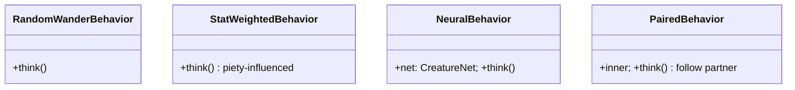
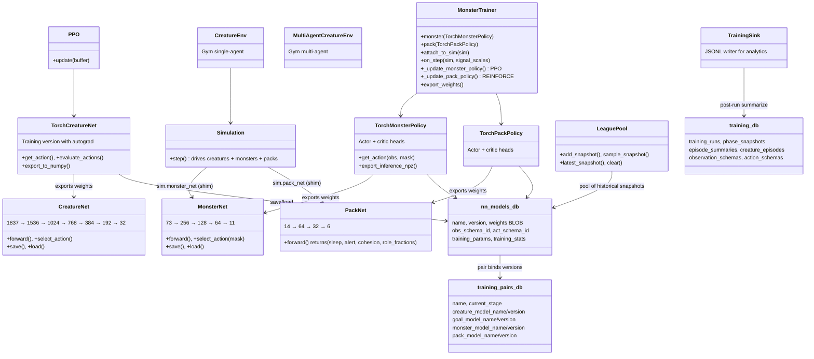

# Class Hierarchy

```mermaid
classDiagram
    Trackable <|-- WorldObject
    Trackable <|-- Inventory
    Trackable <|-- Map
    Trackable <|-- Tile
    Trackable <|-- WorldData
    Trackable <|-- RelationshipGraph
    Trackable <|-- Pack

    WorldObject <|-- Creature
    WorldObject <|-- Monster
    WorldObject <|-- Item
    Item <|-- Stackable
    Item <|-- Equippable
    Item <|-- Structure
    Item <|-- Egg
    Stackable <|-- Consumable
    Stackable <|-- Ammunition
    Consumable <|-- Meat
    Equippable <|-- Weapon
    Equippable <|-- Wearable

    class Trackable {
        +uid: int
        +_timed_events: dict
        +register_tick()
        +process_ticks()
        +all_instances()
    }

    class WorldObject {
        +location: MapKey
        +current_map: Map
        +sprite_name: str
        +collision: bool
        +on_map() list
    }

    CombatMixin <|-- Creature
    SocialMixin <|-- Creature
    MovementMixin <|-- Creature
    InventoryMixin <|-- Creature
    ReproductionMixin <|-- Creature
    RelationshipsMixin <|-- Creature
    ConversationMixin <|-- Creature
    UtilityMixin <|-- Creature
    RegenMixin <|-- Creature
    GoalMixin <|-- Creature

    CombatMixin <|-- Monster
    MovementMixin <|-- Monster
    InventoryMixin <|-- Monster
    RegenMixin <|-- Monster

    class Creature {
        +name, species, sex, age, size
        +stats: Stats
        +inventory: Inventory
        +equipment: dict
        +chromosomes, mother_uid, father_uid
        +deity, piety, quest_log
        +gold, loans, loans_given
        +behavior, observation_mask
        +model_name, model_version
        +_history: deque
        +_cannibalism_events
        creature/ package with mixins
    }

    class Monster {
        +name, species, sex, age, size
        +stats: Stats (CHR neutral=10)
        +meat_value, diet
        +pack: Pack, rank, is_alpha
        +territory_size_max, territory_scales
        +dominance_type, collapse_on_alpha_death
        +active_hours, can_swim
        +natural_weapon_key
        +_pack_sleep_signal, _pack_alert_level
        +_pack_cohesion, _pack_role
        +_pack_target_position
        +_is_fleeing
        NOT a Creature subclass — reuses combat/movement/regen mixins
        stubs: get_relationship, record_interaction, gain_exp,
               is_child, carried_weight, _check_trap
    }

    class Pack {
        +species, territory_center, game_map
        +members_m, members_f (uid lists, rank-ordered)
        +seen_creatures (shared perception dict)
        +member_state (event accumulator)
        +sleep_signal, alert_level, cohesion, role_fractions
        +split_size, territory_size_max, territory_scales
        +dominance_type, collapse_on_alpha_death (from species)
        +effective_territory_size(), sample_target_position()
        +territories_overlap(), can_merge_with(), is_hostile_to()
        +add_member(), remove_member(), broadcast_signals()
        +on_creature_spotted(), on_member_state()
    }

    class RelationshipGraph {
        +_edges, _rumors, _deceits, _loc_rumors
        +_generation (dirty counter)
        +edges_from(), get_edge(), record_interaction()
        +add_rumor(), rumors_of()
        +add_location_rumor(), best_location_rumor()
        +record_deceit(), reveal_deceit()
    }

    class CombatMixin { melee_attack, ranged_attack, cast_spell, grapple, die }
    class SocialMixin { intimidate, deceive, trade, bribe, steal, proselytize, share_location_rumor, record_nearby_location_rumors }
    class MovementMixin { move, enter, exit, flee, follow, run, sneak }
    class InventoryMixin { equip, unequip, pickup, drop, use_item (Meat+cannibalism) }
    class ReproductionMixin { pairing, pregnancy, eggs, bonding }
    class RelationshipsMixin { interactions, rumors, loans }
    class ConversationMixin { dialogue system }
    class UtilityMixin { search, guard, sleep, fatigue, traps, stances }
    class RegenMixin { HP/stamina/mana regen (unregister when full) }
    class GoalMixin { goal selection, spatial memory (event-driven) }

    class Stats {
        +base, mods, active
        +add_mod(), contest()
        +gain_exp()
    }

    class Item {
        +name, value, weight, buffs
        +requirements, action_word
        +effective_kpi(), lifetime_kpi()
    }

    class Meat {
        +species, meat_value
        +spoil_tick, is_cooked, is_preserved
        +is_monster_meat
        +is_spoiled(now)
    }

    class Egg {
        +creature, live, mother_species, father_species
        +days_with_mother, gestation_days
        +_is_monster_egg (optional; tags eggs for monster hatch path)
        +_pack_ref (optional; target pack for monster hatchlings)
        +tick_gestation(), hatch()
    }

    class QuestLog {
        +quests: dict
        +accept_quest(), complete_step()
        +evaluate_conditions()
    }

    class WorldData {
        +gods: dict, dichotomies
        +flags: dict
        +record_action(), get_balance()
    }

    Creature --> Stats
    Creature --> Inventory
    Creature --> QuestLog
    Monster --> Stats
    Monster --> Inventory
    Monster --> Pack
    Pack --> Monster : members
    WorldData --> God
    Map --> Tile
    Tile --> Inventory
```

## Behavior Modules

```mermaid
classDiagram
    class RandomWanderBehavior { +think() }
    class StatWeightedBehavior { +think() piety-influenced }
    class NeuralBehavior { +net: CreatureNet; +think() }
    class PairedBehavior { +inner; +think() follow partner }
```

## Simulation Stack

```mermaid
classDiagram
    class CreatureNet {
        1837 → 1536 → 1024 → 768 → 384 → 192 → 32
        +forward(), +select_action()
        +save(), +load()
    }
    class MonsterNet {
        73 → 256 → 128 → 64 → 11
        +forward(), +select_action(mask)
        +save(), +load()
    }
    class PackNet {
        14 → 64 → 32 → 6
        +forward() returns (sleep, alert, cohesion, role_fractions)
    }
    class TorchCreatureNet {
        Training version with autograd
        +get_action(), +evaluate_actions()
        +export_to_numpy()
    }
    class TorchMonsterPolicy {
        Actor + critic heads
        +get_action(obs, mask)
        +export_inference_npz()
    }
    class TorchPackPolicy {
        Actor + critic heads
    }
    class MonsterTrainer {
        +monster (TorchMonsterPolicy)
        +pack (TorchPackPolicy)
        +attach_to_sim(sim)
        +on_step(sim, signal_scales)
        +_update_monster_policy() PPO
        +_update_pack_policy() REINFORCE
        +export_weights()
    }
    class Simulation { +step() drives creatures + monsters + packs }
    class CreatureEnv { Gym single-agent }
    class MultiAgentCreatureEnv { Gym multi-agent }
    class PPO { +update(buffer) }
    class TrainingSink { JSONL writer for analytics }
    class LeaguePool {
        +add_snapshot(), sample_snapshot()
        +latest_snapshot(), clear()
    }
    PPO --> TorchCreatureNet
    TorchCreatureNet --> CreatureNet : exports weights
    TorchMonsterPolicy --> MonsterNet : exports weights
    TorchPackPolicy --> PackNet : exports weights
    MonsterTrainer --> TorchMonsterPolicy
    MonsterTrainer --> TorchPackPolicy
    CreatureEnv --> Simulation
    Simulation --> MonsterNet : sim.monster_net (shim)
    Simulation --> PackNet   : sim.pack_net (shim)

    class nn_models_db {
        name, version, weights BLOB
        obs_schema_id, act_schema_id
        training_params, training_stats
    }
    class training_pairs_db {
        name, current_stage
        creature_model_name/version
        goal_model_name/version
        monster_model_name/version
        pack_model_name/version
    }
    class training_db {
        training_runs, phase_snapshots
        episode_summaries, creature_episodes
        observation_schemas, action_schemas
    }
    TrainingSink --> training_db : post-run summarize
    TorchCreatureNet --> nn_models_db : save/load
    TorchMonsterPolicy --> nn_models_db
    TorchPackPolicy --> nn_models_db
    nn_models_db --> training_pairs_db : pair binds versions
    LeaguePool --> nn_models_db : pool of historical snapshots
```
