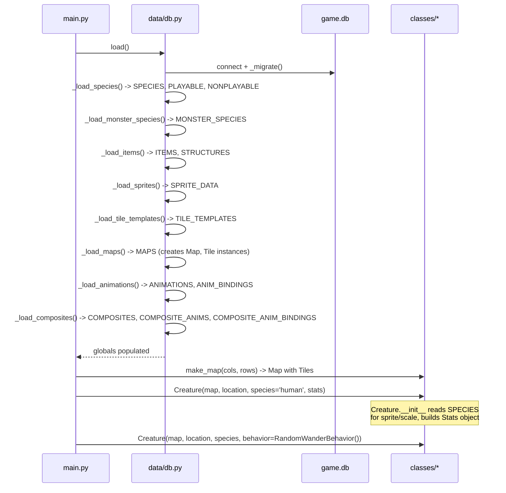
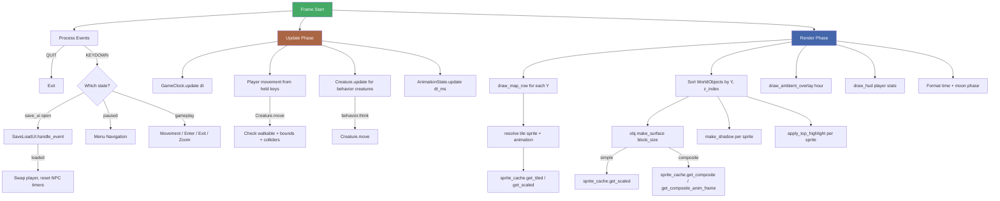
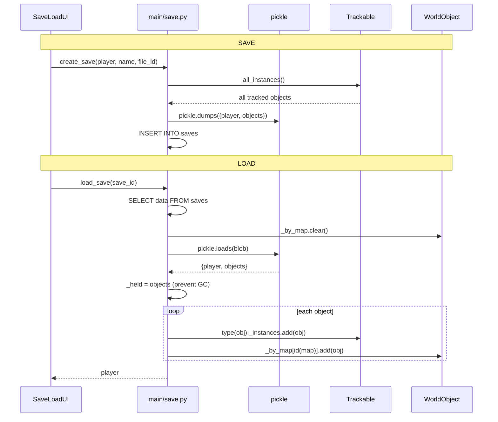
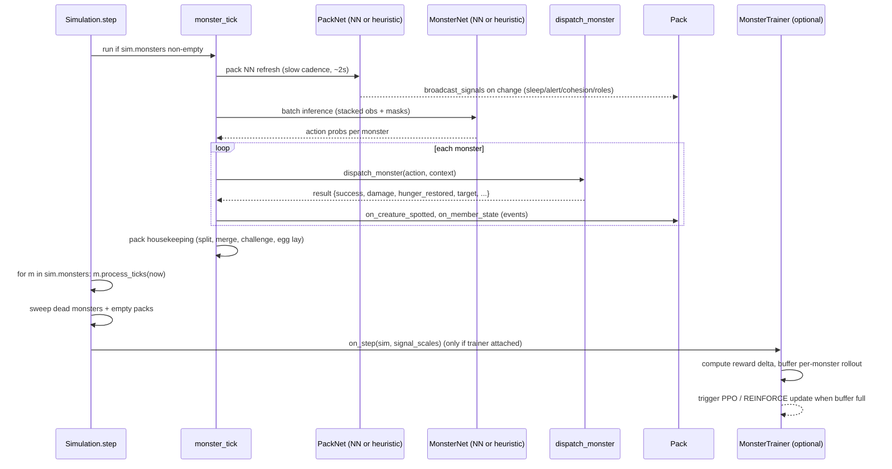
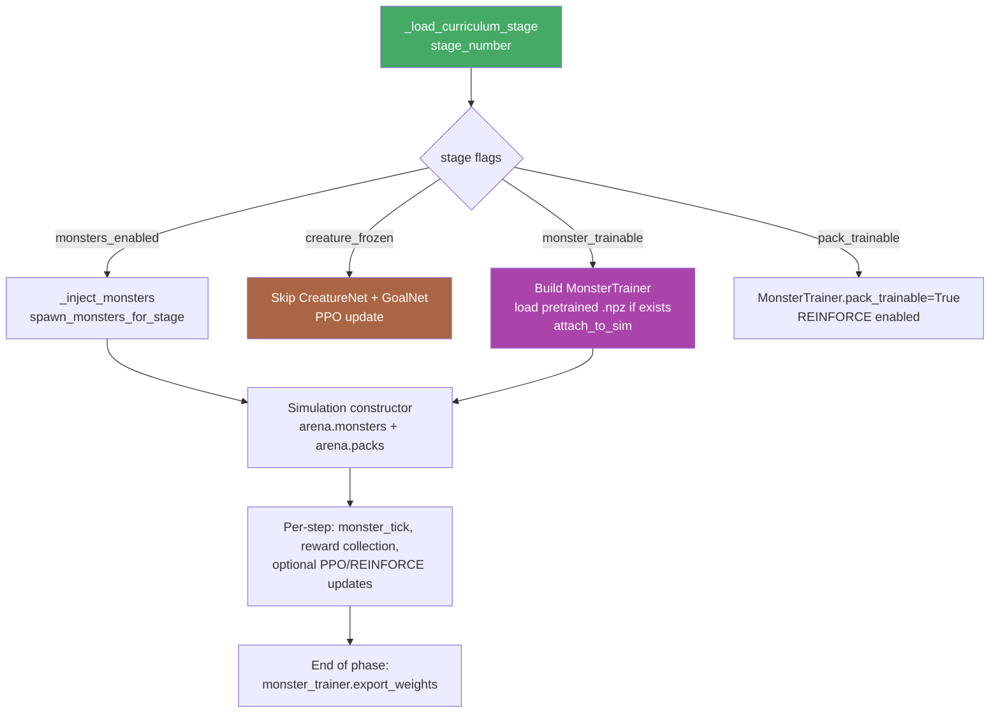
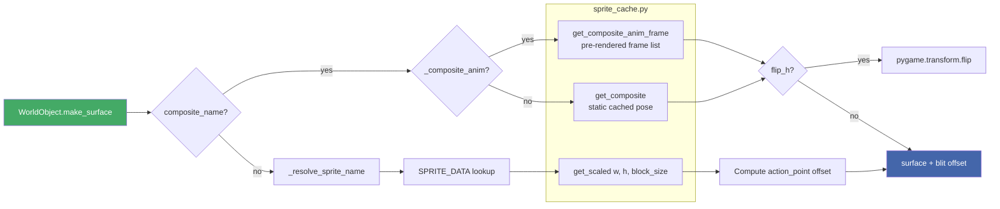

# Data Flow ERD

## Startup Sequence

## Game Loop — Per Frame

## Save / Load Flow

## Monster Tick Flow (headless simulation)

Monsters tick alongside creatures each `Simulation.step()`. The
per-step flow:

## Training Freeze Toggle Flow (curriculum stages 15-25)

Training runners (run_mappo / run_ppo) read stage config and wire
monsters + optimizer behavior accordingly.

## Sprite Rendering Pipeline

