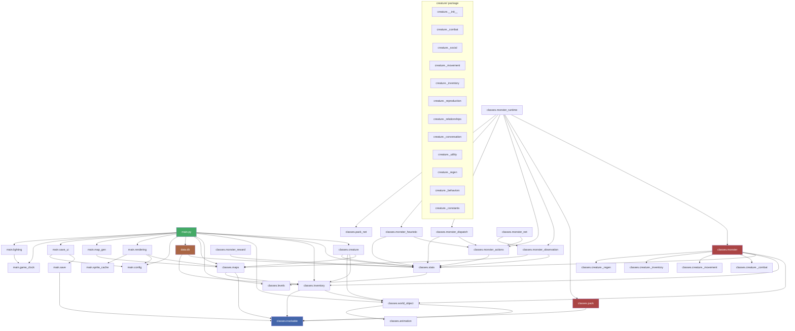

# Import Dependency ERD

## Top-Level (Eager) Imports

These are resolved at module load time.

## Deferred (Local) Imports

These are imported inside functions to break circular dependencies.

```mermaid
graph TD
    classes.creature -.->|__init__| data.db["data.db::SPECIES"]
    classes.creature -.->|enter| classes.inventory["inventory::Structure"]
    classes.creature -.->|enter| data.db_maps["data.db::MAPS"]

    classes.world_object -.->|play_animation| data.db_bindings["data.db::ANIM_BINDINGS<br/>ANIMATIONS<br/>COMPOSITE_ANIM_BINDINGS"]
    classes.world_object -.->|make_surface| data.db_sprites["data.db::SPRITE_DATA"]
    classes.world_object -.->|make_surface| main.sprite_cache
    classes.world_object -.->|make_surface| main.config

    main.rendering -.->|draw_hud| classes.stats
    main.rendering -.->|draw_hud| classes.levels
    main.rendering -.->|_resolve_tile_sprite| data.db_anims["data.db::ANIMATIONS"]

    main.sprite_cache -.->|get_native| data.db_sprites2["data.db::SPRITE_DATA"]
    main.sprite_cache -.->|get_composite| data.db_comp["data.db::COMPOSITES<br/>COMPOSITE_ANIMS"]
    main.sprite_cache -.->|_check_zoom| main.config2["main.config::get_block_size"]

    main.config -.->|set_zoom| main.sprite_cache2["sprite_cache::invalidate"]

    main.save -.->|_deserialise| classes.world_object2["world_object::WorldObject"]

    data.db -.->|_load_maps| classes.maps2["maps::Map, Tile,<br/>MapKey, Bounds"]

    classes.monster -.->|__init__| data.db_monster["data.db::MONSTER_SPECIES"]
    classes.monster -.->|die| classes.inventory_meat["inventory::Meat"]
    classes.monster_runtime -.->|creature sightings| classes.creature2["classes.creature"]
    classes.monster_runtime -.->|egg laying| classes.inventory2["inventory::Egg"]
    classes.monster_dispatch -.->|combat target| classes.creature3["classes.creature"]
    classes.monster_dispatch -.->|weapon lookup| classes.inventory3["inventory::Weapon, Meat"]
    classes.observation -.->|monster slot fill| classes.monster2["classes.monster"]
    classes.observation -.->|pack territory| classes.pack2["classes.pack"]
    classes.creature._inventory -.->|cannibalism detection| classes.inventory_meat2["inventory::Meat"]
    classes.creature._social -.->|territory rumor records| classes.monster3["classes.monster"]

    linkStyle 0,1,2,3,4,5,6,7,8,9,10,11,12,13,14,15,16,17,18,19,20,21 stroke-dasharray: 5 5
```

## Circular Dependency Chains

These chains require deferred imports to function:

| Chain | Resolved By |
|-------|-------------|
| `world_object` -> `data.db` -> `classes.stats` -> `levels` | `world_object` defers `data.db` imports |
| `world_object` -> `sprite_cache` -> `data.db` -> `inventory` -> `world_object` | `sprite_cache` defers `data.db` imports |
| `config` <-> `sprite_cache` | `config` defers `invalidate` call; `sprite_cache` defers `config` reads |
| `creature` -> `data.db` -> `stats` + `inventory` -> `world_object` -> `trackable` | `creature` defers `data.db::SPECIES` lookup |
| `monster` -> `creature._combat` (shared mixin) | `monster.die` path avoids re-import loops; mixin methods use duck typing |
| `observation` -> `monster` -> `creature` (perception slot) | `observation` defers `monster` import inside the slot-population block |
| `creature._inventory` -> `inventory::Meat` | deferred inside `use_item` to avoid circular import |
