# Master ERD — Module Relationships

Links to scoped diagrams:

- [Class Hierarchy](class_hierarchy.md) — inheritance tree for all game classes
- [Import Dependencies](import_dependencies.md) — which files import from which
- [Data Flow](data_flow.md) — how data moves at runtime (load, update, render, save)
- [Stats System](stats_system.md) — stat layers, derived formulas, opposing stat contests
- [RL Pipeline](rl_pipeline.md) — training architecture, observation, reward, simulation
- [Monsters & Packs](monsters.md) — Monster class, Pack coordination, MonsterNet/PackNet NNs

## High-Level Module Map

```mermaid
graph TB
    subgraph Entry
        MAIN[main.py<br/>game loop]
    end

    subgraph classes/
        TRACK[trackable.py<br/>Trackable]
        WO[world_object.py<br/>WorldObject]
        CREA[creature.py<br/>Creature + Behaviors]
        STATS[stats.py<br/>Stat, Stats]
        INV[inventory.py<br/>Item hierarchy, Inventory, Egg, Meat]
        MAPS[maps.py<br/>Map, Tile, MapKey, Bounds]
        ANIM[animation.py<br/>AnimationState]
        LVL[levels.py<br/>exp/level math]
        GENETICS[genetics.py<br/>chromosomes, inheritance]
        GODS[gods.py<br/>God, WorldData, piety]
        QUEST[quest.py<br/>QuestLog, QuestState]
        OBS[observation.py<br/>1837-input vector, masks]
        REWARD[reward.py<br/>29 creature signals, ln transforms]
        ACTIONS[actions.py<br/>32 actions, dispatch]
        VAL[valuation.py<br/>KPI, decompounding, trade pricing]
        TEMPORAL[temporal.py<br/>history buffer, transforms]
        MON[monster.py<br/>Monster top-level class]
        PACK[pack.py<br/>Pack coordination + territory]
        MONACT[monster_actions.py<br/>11 actions, INT-gated mask]
        MONOBS[monster_observation.py<br/>73-input vector]
        MONDISP[monster_dispatch.py<br/>11 monster action handlers]
        MONRT[monster_runtime.py<br/>monster_tick, pack housekeeping]
        MONREW[monster_reward.py<br/>16 monster signals]
        MONNET[monster_net.py<br/>MonsterNet inference]
        PACKNET[pack_net.py<br/>PackNet inference + build_pack_obs]
        MONHEUR[monster_heuristic.py<br/>priority cascade policy]
    end

    subgraph main/
        CFG[config.py<br/>screen, zoom, constants]
        REND[rendering.py<br/>draw_map_row, draw_hud]
        SCACHE[sprite_cache.py<br/>sprite/composite caching]
        LIGHT[lighting.py<br/>ambient, shadows, highlights]
        GCLOCK[game_clock.py<br/>GameClock, day/night, moon]
        MGEN[map_gen.py<br/>make_map]
        SAVE[save.py<br/>pickle serialization]
        SAVEUI[save_ui.py<br/>SaveLoadUI modal]
    end

    subgraph simulation/
        ARENA[arena.py<br/>spawn_creature, generate_arena, spawn_monsters_for_stage]
        HEADLESS[headless.py<br/>Simulation tick loop + monsters]
        NET[net.py<br/>CreatureNet 5-layer]
        ENV[env.py<br/>CreatureEnv, MultiAgentEnv]
        TRAIN[train.py<br/>MAPPO → ES → PPO + monster freeze toggles]
        MONTRAIN[monster_train.py<br/>MonsterTrainer: PPO + REINFORCE]
        MONPRE[monster_pretrain.py<br/>imitation + DAgger]
        LEAGUE[league_pool.py<br/>snapshot pool for co-evolution]
    end

    subgraph data/
        DB[db.py<br/>load, migrate, globals]
        SEED[seed.py<br/>canonical schema]
    end

    MAIN --> CREA
    MAIN --> STATS
    MAIN --> INV
    MAIN --> WO
    MAIN --> MAPS
    MAIN --> DB
    MAIN --> CFG
    MAIN --> REND
    MAIN --> MGEN
    MAIN --> SAVEUI
    MAIN --> GCLOCK
    MAIN --> LIGHT

    CREA --> WO
    CREA --> STATS
    CREA --> INV
    CREA --> MAPS
    CREA --> GENETICS
    CREA --> QUEST
    CREA --> ACTIONS
    CREA --> OBS
    CREA -.-> DB
    CREA -.-> GODS
    CREA -.-> VAL

    WO --> TRACK
    WO --> ANIM
    WO -.-> DB
    WO -.-> SCACHE
    WO -.-> CFG

    INV --> WO
    INV --> TRACK
    MAPS --> TRACK
    MAPS --> INV
    STATS --> LVL

    OBS --> STATS
    OBS --> TEMPORAL
    OBS -.-> GODS
    REWARD --> STATS
    REWARD -.-> GODS
    ACTIONS -.-> DB
    ACTIONS -.-> GODS
    VAL --> STATS
    TEMPORAL --> STATS
    GENETICS --> STATS
    GODS --> TRACK

    REND --> MAPS
    REND --> SCACHE
    REND --> CFG
    REND -.-> STATS
    REND -.-> DB

    SCACHE -.-> DB
    SCACHE -.-> CFG
    LIGHT --> GCLOCK

    SAVEUI --> SAVE
    SAVE --> TRACK
    SAVE -.-> WO

    DB --> STATS
    DB --> INV
    DB -.-> MAPS

    TRAIN --> NET
    TRAIN --> ARENA
    TRAIN --> HEADLESS
    TRAIN --> OBS
    TRAIN --> REWARD
    TRAIN --> ACTIONS
    TRAIN --> CREA

    HEADLESS --> OBS
    HEADLESS --> REWARD
    HEADLESS --> TEMPORAL
    HEADLESS -.-> GODS

    ENV --> HEADLESS
    ENV --> ARENA
    ENV --> OBS
    ENV --> REWARD
    ENV --> ACTIONS

    ARENA --> CREA
    ARENA --> MAPS
    ARENA --> INV
    ARENA --> GENETICS
    ARENA -.-> GODS

    NET --> OBS
    NET --> ACTIONS

    MON --> WO
    MON --> STATS
    MON --> INV
    MON --> MAPS
    MON -.-> DB
    PACK --> TRACK
    PACK -.-> MON
    MONRT --> MON
    MONRT --> PACK
    MONRT --> MONDISP
    MONRT --> MONACT
    MONRT --> MONOBS
    MONRT --> MONHEUR
    MONDISP --> MON
    MONDISP --> INV
    MONOBS --> MON
    MONOBS --> STATS
    MONOBS --> PACK
    MONACT --> STATS
    MONREW --> MON
    MONREW --> PACK
    MONHEUR --> MON
    MONNET --> MONOBS
    MONNET --> MONACT
    PACKNET --> PACK

    HEADLESS --> MONRT
    ARENA --> MON
    ARENA --> PACK

    MONTRAIN --> MON
    MONTRAIN --> PACK
    MONTRAIN --> MONOBS
    MONTRAIN --> MONACT
    MONTRAIN --> MONREW
    MONTRAIN --> PACKNET
    MONPRE --> MONHEUR
    MONPRE --> MONOBS
    TRAIN --> MONTRAIN
    TRAIN --> LEAGUE

    style MAIN fill:#4a6,color:#fff
    style DB fill:#a64,color:#fff
    style TRACK fill:#46a,color:#fff
    style TRAIN fill:#a4a,color:#fff
    style NET fill:#a4a,color:#fff
    style MON fill:#a44,color:#fff
    style PACK fill:#a44,color:#fff
    style MONTRAIN fill:#a4a,color:#fff
    style MONNET fill:#a4a,color:#fff
    style PACKNET fill:#a4a,color:#fff
```

**Legend:** Solid arrows = top-level imports. Dashed arrows = deferred/local imports.
