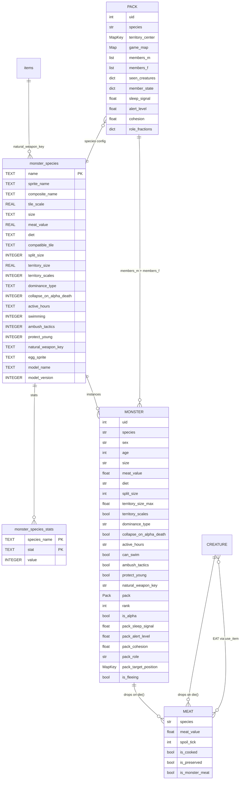
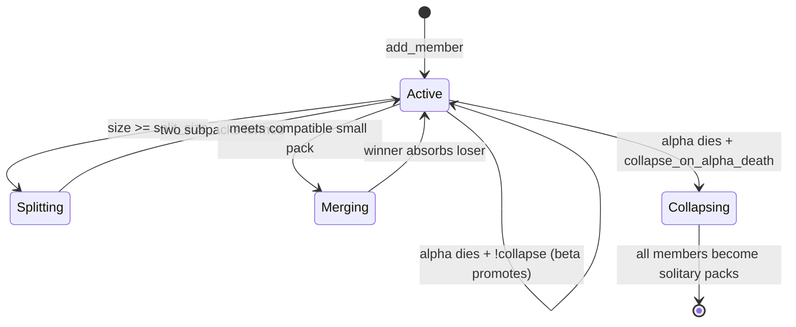
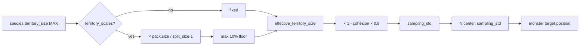
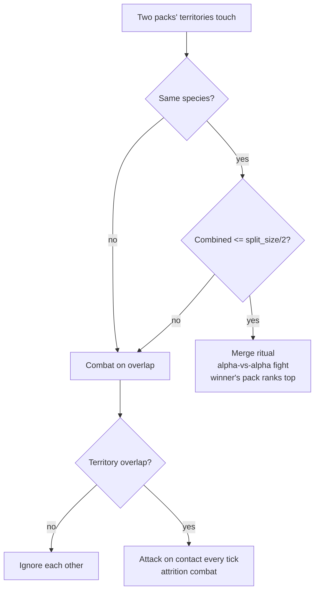
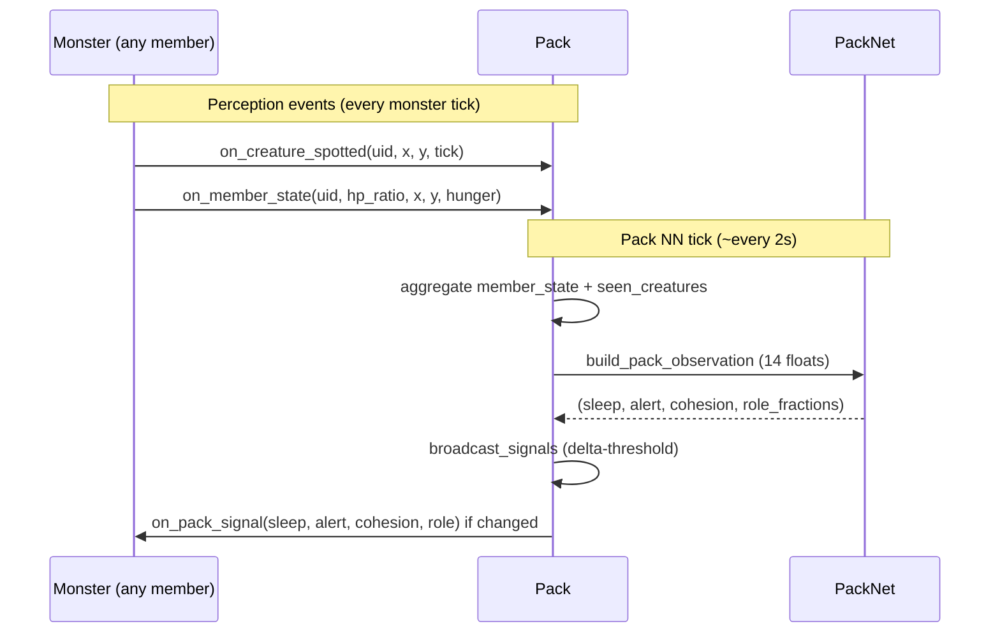
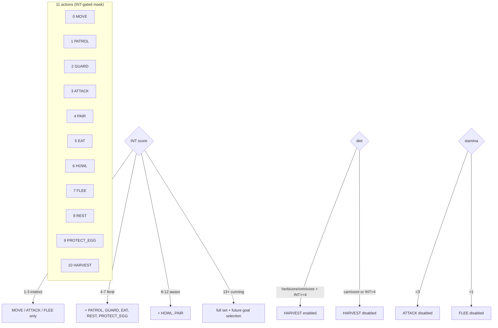
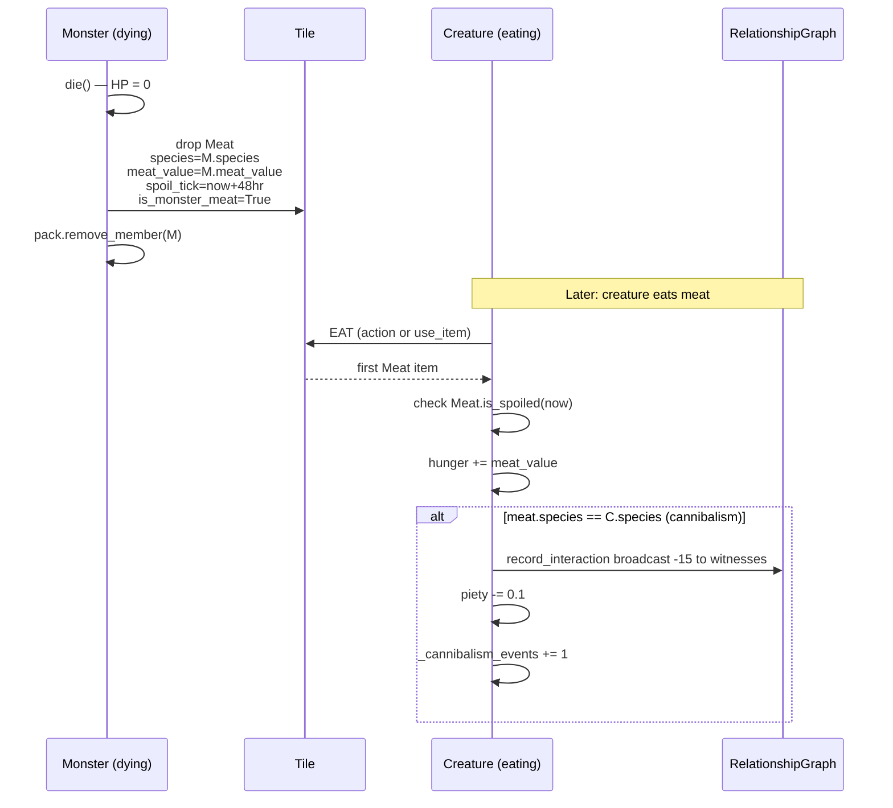
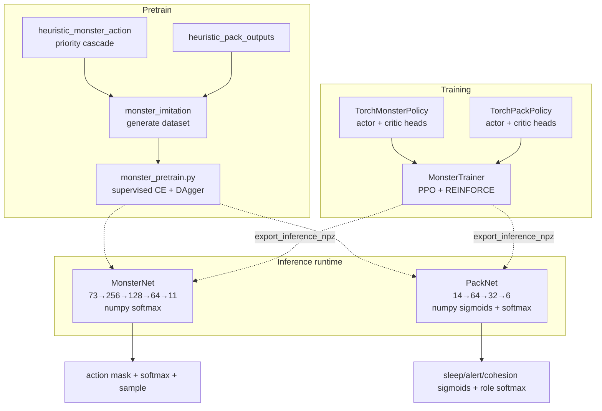

# Monsters & Packs ERD

Monsters are a parallel entity hierarchy to creatures. They share
combat/movement/regen infrastructure via mixin reuse (no inheritance
from Creature) and are coordinated by a `Pack` class that holds its
own NN.

## Entity Relationships



## Monster → Pack Relationship

Every monster is a member of exactly one pack. Solitary species
(cave_bear) still live in a size-1 pack. When a pack's alpha dies:

- Species with `collapse_on_alpha_death=True` (bees, army_ants) →
  the pack dissolves; each survivor becomes its own 1-member pack.
- Species with `collapse_on_alpha_death=False` (wolves, orcs) → the
  next-ranked member auto-promotes and the pack persists.



## Territory Math

Effective roaming standard deviation for a pack:

```
if species.territory_scales:
    effective = species.territory_size × (pack.size / max(1, split_size-1))
    effective = max(species.territory_size × 0.1, effective)
else:
    effective = species.territory_size

sampling_std = effective × (1 - cohesion × 0.8)
```

Each monster samples a target position from `N(territory_center, sampling_std)`.
The 3σ practical radius is used for territory overlap checks.



## Pack-vs-Pack Interactions



## Shared Perception

Monsters push perceptions into their pack's shared state; the pack NN
consumes aggregated values on its next tick.



## Monster Action Space



## Death → Meat → Consumption Loop



## NN Stack — Monster + Pack



## Curriculum Stages for Monsters

| Stage | Name | Creature | Monster | Pack | Focus |
|---|---|---|---|---|---|
| 15 | M_Survive | frozen | training | n/a | solo hunger + territory |
| 16 | M_Eat | frozen | training | n/a | meat + grazing |
| 17 | M_Hunt | frozen | training | n/a | kill + chase |
| 18 | M_Pack | frozen | training | training | cohesion + coordination |
| 19 | M_Dominance | frozen | training | training | challenges + pairing |
| 20 | M_Lifecycle | frozen | training | training | eggs + splits + merges |
| 21 | C_Predation | **training** | frozen | frozen | threat avoidance + cannibalism penalty |
| 22 | C_Ecosystem | **training** | frozen | frozen | queen-targeting + territory rumors |
| 23 | Coevo_A | training | training | training | alternating epochs |
| 24 | Coevo_B | training | training | training | league training (if needed) |
| 25 | Final | training | training | training | reduced LR, equilibrium |

## File Reference

| File | Purpose |
|------|---------|
| `src/classes/monster.py` | Monster class (WorldObject-based, reuses mixins) |
| `src/classes/pack.py` | Pack (Trackable) — territory, dominance, signals |
| `src/classes/monster_actions.py` | 11 actions + compute_monster_mask |
| `src/classes/monster_observation.py` | 73-float observation builder |
| `src/classes/monster_dispatch.py` | Action dispatch table |
| `src/classes/monster_runtime.py` | monster_tick + pack housekeeping |
| `src/classes/monster_reward.py` | 16 signals + snapshot |
| `src/classes/monster_heuristic.py` | Priority cascade policies |
| `src/classes/monster_net.py` | MonsterNet numpy inference |
| `src/classes/pack_net.py` | PackNet numpy inference |
| `src/classes/monster_imitation.py` | Dataset generator |
| `src/classes/inventory.py::Meat` | Meat item subclass |
| `editor/simulation/monster_train.py` | MonsterTrainer (PPO + REINFORCE) |
| `editor/simulation/monster_pretrain.py` | Imitation + DAgger pretrain |
| `editor/simulation/league_pool.py` | Snapshot pool for co-evolution |
| `editor/monster_species_tab.py` | Editor tab for monster_species DB |
| `editor/training_pairs_tab.py` | Training pair management |
