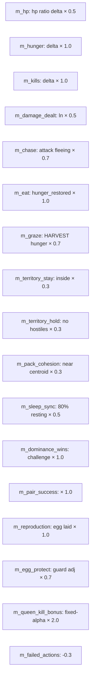
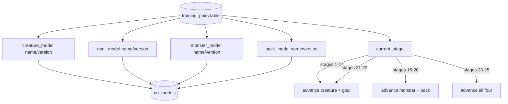

# RL Training Pipeline

## Architecture Overview

Four networks co-evolve in the world:

- **CreatureNet** — creature action policy (1837 → 32 actions)
- **GoalNet** — creature hierarchical goal selection
- **MonsterNet** — monster action policy (73 → 11 actions, INT-masked)
- **PackNet** — pack-level coordination (14 → 6 signals)

Creature training runs first (stages 1-14), then monsters bootstrap
against frozen creatures (stages 15-20), then creatures adapt to frozen
monsters (stages 21-22), then co-evolution (stages 23-25).

```mermaid
graph TD
    subgraph "Curriculum (25 stages)"
        S1_14[Stages 1-14: Creature curriculum<br/>Wander → Pickup → Hunger → Purpose →<br/>Harvest → Process → Jobs → Trade →<br/>Schedule → Reputation → Combat →<br/>Lifecycle → Religion → Mastery]
        S15_20[Stages 15-20: Monster bootstrap<br/>M_Survive → M_Eat → M_Hunt → M_Pack →<br/>M_Dominance → M_Lifecycle<br/>CREATURE FROZEN, MONSTER TRAINABLE]
        S21_22[Stages 21-22: Creature adaptation<br/>C_Predation → C_Ecosystem<br/>MONSTER FROZEN, CREATURE TRAINABLE<br/>Cannibalism penalty active]
        S23_25[Stages 23-25: Co-evolution<br/>Coevo_A (alternating) →<br/>Coevo_B (league) →<br/>Final (reduced LR)]
        S1_14 --> S15_20 --> S21_22 --> S23_25
    end

    subgraph "Within-stage phases"
        MAPPO[Phase 1: MAPPO<br/>All agents share weights]
        ES[Phase 2: ES<br/>Weight variants, break Nash]
        PPO[Phase 3: PPO<br/>Single agent vs diverse pool]
        MAPPO --> ES --> PPO
    end

    subgraph "Per-Tick Data Flow (creature)"
        CREATURE[Creature State]
        HISTORY[History Buffer deque100]
        OBS_BUILD[build_observation<br/>1837 float vector]
        MASK[Observation Mask]
        NET[CreatureNet<br/>1837→1536→1024→768→384→192→32]
        ACTION[dispatch 32 actions]
        SNAP[Reward Snapshot]
        REWARD[compute_reward<br/>29 signals + penalties]

        CREATURE --> OBS_BUILD
        HISTORY --> OBS_BUILD
        OBS_BUILD --> MASK --> NET
        NET --> ACTION --> CREATURE
        CREATURE --> SNAP --> REWARD
        REWARD --> BUFFER[Rollout Buffer]
        CREATURE --> HISTORY
    end

    subgraph "Per-Tick Data Flow (monster)"
        MON[Monster State]
        MON_OBS[build_monster_observation<br/>73 float vector]
        MON_MASK[compute_monster_mask<br/>INT-gated + diet-gated]
        MN[MonsterNet<br/>73→256→128→64→11]
        MON_ACT[dispatch_monster 11 actions]
        MON_REW[compute_monster_reward<br/>16 signals]
        MON_BUF[per-monster rollout]

        MON --> MON_OBS --> MN
        MON_MASK --> MN
        MN --> MON_ACT --> MON
        MON --> MON_REW --> MON_BUF
    end

    subgraph "Pack Tick (slow cadence ~2s)"
        PACK[Pack Aggregated State]
        PACK_OBS[build_pack_observation<br/>14 floats:<br/>active_period, light,<br/>mean/std dist from center,<br/>pairwise cohesion,<br/>mean/min HP, mean/max fatigue,<br/>size, egg count,<br/>visible creatures, distances]
        PN[PackNet<br/>14→64→32→6]
        OUT[sleep, alert, cohesion<br/>+ 3-way role softmax]
        BROADCAST[broadcast_signals<br/>delta-threshold event]

        PACK --> PACK_OBS --> PN --> OUT --> BROADCAST
    end
```

## Creature Observation Layout (1837 floats)

Monster-related slots are pre-allocated so creature checkpoints from
stages 1-14 remain loadable when monsters are introduced in stage 21+.

```mermaid
graph LR
    S1[Self base 14<br/>STR/VIT/AGL/PER/INT/CHR/LCK + dmod]
    S2[Self derived 36<br/>HP_MAX, MELEE_DMG, DODGE, SIGHT, ...]
    S3[Self resources 10<br/>HP/stam/mana current + regen bools]
    S4[Self combat 17]
    S5[Self economy 20]
    S6[Slots 14]
    S7[Weapon 15]
    S8[Inv texture 13]
    S9[Crafting 6]
    S10[Social 10]
    S11[Status 16]
    S12[Hunger 6]
    S13[Quest 10]
    S14[Goal 21]
    S15[Schedule 10]
    S16[Movement 8]
    S17[Genetics 7]
    S18[Identity 25<br/>species one-hot, deity]
    S19[Reputation 6]
    S20[Tile deep 21]
    S21[Tile liquid 25]
    S22[Spatial walls 25]
    S23[Spatial features 16]
    S24[Tile items 27]
    S25[Census visible 45]
    S26[Census audible 3]
    S27[Per-engaged 270<br/>10 slots × 51 fields]
    S28[World time 6<br/>is_day, light, 4 god balances]
    S29[Monster slots 30<br/>5 × distance/size/threat/fleeing/pack_sz/in_terr]
    S30[Monster summary 3<br/>count, nearest, in_any_territory]
    S31[Temporal 14]
    S32[Trends 11]
    S33[Time since 12]
    S34[Reward signals 17]
    S35[Transforms ~1048]
```



## Training Cycle Detail

```mermaid
sequenceDiagram
    participant T as train.py
    participant STAGE as stage config
    participant MT as MonsterTrainer (optional)
    participant N as TorchCreatureNet
    participant MN as TorchMonsterPolicy
    participant A as Arena
    participant S as Simulation

    Note over T: Stage N begins
    T->>STAGE: _load_curriculum_stage(N)
    STAGE-->>T: flags, signal_scales, action_mask

    T->>A: generate_arena + _inject_monsters(stage)
    A->>S: arena.monsters + arena.packs populated

    alt stage.monster_trainable
        T->>MT: build_from_pretrained
        MT->>MT: attach_to_sim(sim)<br/>replaces heuristic with NN-driven actions
    end

    rect rgb(40, 80, 40)
        Note over T,S: Phase 1: MAPPO
        loop Every tick
            S->>N: forward(creature obs) per creature
            N->>S: creature actions
            S->>S: dispatch
            S->>S: monster_tick (NN or heuristic)
            opt monster_trainable
                S->>MT: on_step(sim, signal_scales)
                MT->>MT: buffer per-monster rollout
                MT->>MT: PPO / REINFORCE when full
            end
            S->>T: (obs, action, reward, done) per creature
        end
        opt stage.creature_frozen
            T->>T: skip creature PPO update (buffer clears)
        end
        T->>N: Save cycle checkpoint
        opt monster_trainable
            T->>MT: export_weights → monster_net_trained.npz
        end
    end

    rect rgb(40, 40, 80)
        Note over T,S: Phase 3: PPO (same pattern as MAPPO with 1 agent)
    end

    Note over T: Stage N complete → advance pair.current_stage
```



## Monster Reward Function (16 signals)



## Creature Reward Function (29 signals)

Unchanged from prior spec. Key creature-side monster-interaction
signals activated in stages 21+:

- **m_avoid_threat** — rewards creature for avoiding monster territories
- **m_cannibal_penalty** — negative when creature eats own species (-15 sentiment broadcast fires too)
- **m_queen_kill_bonus** — rewards killing a fixed-dominance alpha (same as monster-side)

## Observation Mask System

Unchanged from prior spec — 14 preset masks operate on creature observation.

## Training Pair Versioning

Training pairs bind model versions so a pair's state is fully
reproducible at any stage.



## File Reference

| File | Purpose | Approx lines |
|------|---------|------|
| `classes/observation.py` | 1837-float creature observation | ~1700 |
| `classes/monster_observation.py` | 73-float monster observation | ~250 |
| `classes/reward.py` | 29 creature reward signals | ~300 |
| `classes/monster_reward.py` | 16 monster reward signals | ~200 |
| `classes/temporal.py` | History buffer + transforms | ~300 |
| `classes/actions.py` | 32-action enum + dispatch | ~400 |
| `classes/monster_actions.py` | 11-action enum + INT-gated mask | ~100 |
| `classes/monster_dispatch.py` | 11 monster action handlers | ~300 |
| `classes/monster_runtime.py` | monster_tick + pack housekeeping | ~320 |
| `classes/monster_heuristic.py` | Priority cascade monster/pack policies | ~120 |
| `classes/monster_net.py` | MonsterNet numpy inference | ~120 |
| `classes/pack_net.py` | PackNet numpy inference + build_pack_observation | ~180 |
| `simulation/net.py` | CreatureNet numpy | ~180 |
| `simulation/torch_net.py` | Training creature net (autograd) | ~350 |
| `simulation/monster_train.py` | MonsterTrainer (PPO + REINFORCE) | ~380 |
| `simulation/monster_pretrain.py` | Imitation + DAgger pretraining | ~300 |
| `simulation/league_pool.py` | Snapshot pool for co-evolution | ~100 |
| `simulation/arena.py` | spawn_creature + spawn_monsters_for_stage | ~320 |
| `simulation/headless.py` | Tick loop driving creatures + monsters | ~400 |
| `simulation/env.py` | Gym-compatible environments | ~220 |
| `simulation/train.py` | MAPPO → ES → PPO + freeze toggles + monster trainer attach | ~1700 |
