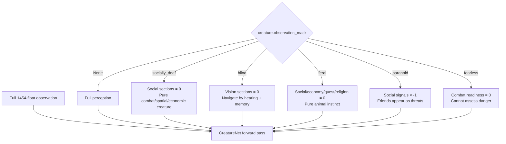

# RL Training Pipeline

## Architecture Overview

```mermaid
graph TD
    subgraph "Training Pipeline (train.py)"
        MAPPO[Phase 1: MAPPO<br/>All creatures share weights<br/>Learn multi-agent dynamics]
        ES[Phase 2: ES<br/>50 weight variants<br/>Break Nash equilibrium]
        PPO[Phase 3: PPO<br/>Single agent vs diverse pool<br/>Sharpen robust policy]
        MAPPO --> ES --> PPO
        PPO -->|repeat cycle| MAPPO
    end

    subgraph "Per-Tick Data Flow"
        CREATURE[Creature State<br/>stats, inventory, relationships<br/>position, health, gold, deity]
        HISTORY[History Buffer<br/>deque(maxlen=100)<br/>per-creature ring buffer]
        OBS_BUILD[build_observation()<br/>786 base + 668 temporal<br/>= 1454 float vector]
        MASK[Observation Mask<br/>socially_deaf, blind, feral<br/>14 presets + custom]
        NET[CreatureNet<br/>1454 → 1024 → 512 → 256 → 49<br/>2.16M params, ReLU + softmax]
        ACTION[dispatch()<br/>49 actions → creature methods<br/>god counter recording]
        SNAP[Reward Snapshot<br/>HP, gold, debt, reputation<br/>allies, kills, piety, quests]
        REWARD[compute_reward()<br/>13 signals × ln transform<br/>death/fatigue/failed penalties]

        CREATURE --> OBS_BUILD
        HISTORY --> OBS_BUILD
        OBS_BUILD --> MASK
        MASK --> NET
        NET -->|action probabilities| ACTION
        ACTION -->|modifies| CREATURE
        CREATURE --> SNAP
        SNAP --> REWARD
        REWARD -->|float| BUFFER[PPO Buffer]
        CREATURE -->|snapshot| HISTORY
    end

    subgraph "Observation Vector (1454 floats)"
        S1[Self: 14 base stats raw+dmod]
        S2[Self: 36 derived stats]
        S3[Self: 6 resources HP/stam/mana]
        S4[Self: 17 combat readiness]
        S5[Self: 20 economy gold/debt/inv]
        S6[Self: 14 equipment slots]
        S7[Self: 15 weapon/ammo/spell]
        S8[Self: 13 inventory texture]
        S9[Self: 10 social capital]
        S10[Self: 16 status/reproduction]
        S11[Self: 10 quest/progression]
        S12[Self: 8 movement/position]
        S13[Self: 7 genetics]
        S14[Self: 25 identity/species/deity]
        S15[Self: 6 reputation]
        S16[Tile: 18 current tile deep]
        S17[Spatial: 25 walls/openness]
        S18[Spatial: 12 feature directions]
        S19[Tile: 27 top-3 items]
        S20[Census: 45 visible creatures]
        S21[Census: 3 audible]
        S22[Engaged: 45 × 6 = 270]
        S23[World: 13 time/gods]
        S24[Temporal: 14 immediate deltas]
        S25_26[Temporal: 691 transforms<br/>ln ratio, sign, stdev, accel<br/>momentum, z-score, rel-pos<br/>cross-var interactions<br/>time-since-events]
        S27[Reward: 17 signal values]
        S28[Transforms: 102 wild<br/>sq, sqrt, recip, sigmoid<br/>interaction terms]
    end

    subgraph "Reward Function (13 signals)"
        R1["1. HP change: ln × 8.0"]
        R2["2. Wealth: ln × 3.0"]
        R3["3. Debt reduction: ln × 2.0"]
        R4["4. Inventory value: ln × 1.0"]
        R5["5. Equipment KPI: ln × 2.0"]
        R6["6. Reputation: ln × 3.0<br/>sumproduct(sent,depth)/sum(depth)"]
        R7["7. Ally count: delta × 1.0"]
        R8["8. Kills: delta × 3.0"]
        R9["9. Exploration: tiles 0.2 + creatures 0.5"]
        R10["10. Piety: ln × 2.0 + world balance"]
        R11["11. Quests: steps 5.0 / complete 10.0"]
        R12["12. Life goals: delta × 2.0"]
        R13["13. XP activity: sign(ln) × 0.05"]
        RP["Penalties: death -20, failed -0.5<br/>fatigue -1.5/tier, underwater -0.5/tick"]
    end
```

## Training Cycle Detail

```mermaid
sequenceDiagram
    participant T as train.py
    participant N as CreatureNet
    participant A as Arena
    participant S as Simulation
    participant C as Creatures

    Note over T: Cycle N begins

    rect rgb(40, 80, 40)
        Note over T,C: Phase 1: MAPPO (100K steps)
        T->>N: Initialize / load weights
        T->>A: generate_arena(8 creatures)
        A->>C: spawn_creature() × 8 (genetics, sex, deity, gold)
        T->>S: Simulation(arena, tick_ms=500)
        loop Every tick
            S->>C: process_ticks(now)
            C->>N: forward(observation) — same weights all creatures
            N->>C: action probabilities
            C->>C: dispatch(action)
            S->>T: (obs, action, reward, done) per creature
        end
        T->>N: PPO update every 2048 steps
        T->>N: Save mappo_cycleN.npz
    end

    rect rgb(80, 40, 40)
        Note over T,N: Phase 2: ES (50 gens × 50 variants)
        loop Each generation
            T->>N: Generate 50 noise variants
            loop Each variant
                T->>A: generate_arena()
                T->>S: Run 2000 steps
                S->>T: total_reward
            end
            T->>N: Keep top 20%, average noise, update base
        end
        T->>N: Save es_cycleN.npz
    end

    rect rgb(40, 40, 80)
        Note over T,C: Phase 3: PPO (100K steps)
        T->>A: generate_arena(8 creatures)
        Note over C: Creature[0] = agent (latest weights)
        Note over C: Creatures[1-7] = opponents (old checkpoints + StatWeighted)
        loop Every tick
            C->>N: Agent: forward(observation)
            N->>C: action
            C->>C: Opponents: behavior.think()
            S->>T: (obs, action, reward, done) for agent
        end
        T->>N: PPO update every 2048 steps
        T->>N: Save ppo_cycleN.npz
    end

    Note over T: Cycle N complete → repeat
    T->>N: Save final.npz after all cycles
```



## Creature Spawning (arena.py)

```mermaid
graph LR
    SPECIES[Species Defaults<br/>human: STR 10, VIT 10, ...]
    GENETICS[generate_chromosomes(sex)<br/>14 genes, sex-linked biases]
    EXPRESS[express(chromosomes)<br/>dominance → stat mods -3 to +3]
    APPLY[apply_genetics()<br/>species + genetic mods]
    PROFILE[random_stats(profile)<br/>fighter/mage/rogue/social]
    BLEND[Blend 60% genetics<br/>+ 40% profile]

    SPECIES --> APPLY
    GENETICS --> EXPRESS --> APPLY
    APPLY --> BLEND
    PROFILE --> BLEND

    BLEND --> CREATURE[Creature]
    SEX[random sex] --> CREATURE
    AGE[random age 18-200] --> CREATURE
    DEITY[random deity 70%] --> CREATURE
    GOLD[random gold] --> CREATURE
    EQUIP[random weapon + armor] --> CREATURE
    MASK[observation mask?] --> CREATURE
    PRUD[prudishness ± 0.2] --> CREATURE
```

## Observation Mask System



## File Reference

| File | Purpose | Size |
|------|---------|------|
| `classes/observation.py` | Build 1454-float observation vector | ~850 lines |
| `classes/reward.py` | 13 reward signals + ln transforms | ~160 lines |
| `classes/temporal.py` | History buffer + 691 temporal features | ~210 lines |
| `classes/actions.py` | 49-action enum + dispatch | ~280 lines |
| `classes/valuation.py` | Item KPI, decompounding, trade pricing | ~210 lines |
| `classes/genetics.py` | Chromosomes, inheritance, inbreeding | ~180 lines |
| `classes/gods.py` | 8 gods, piety drift, world balance | ~180 lines |
| `classes/quest.py` | QuestLog, safe eval, time limits | ~180 lines |
| `simulation/net.py` | CreatureNet 3-layer feedforward | ~150 lines |
| `simulation/arena.py` | spawn_creature, generate_arena | ~230 lines |
| `simulation/headless.py` | Tick loop, history population | ~100 lines |
| `simulation/env.py` | Gym-compatible environments | ~200 lines |
| `simulation/train.py` | MAPPO → ES → PPO pipeline | ~480 lines |
