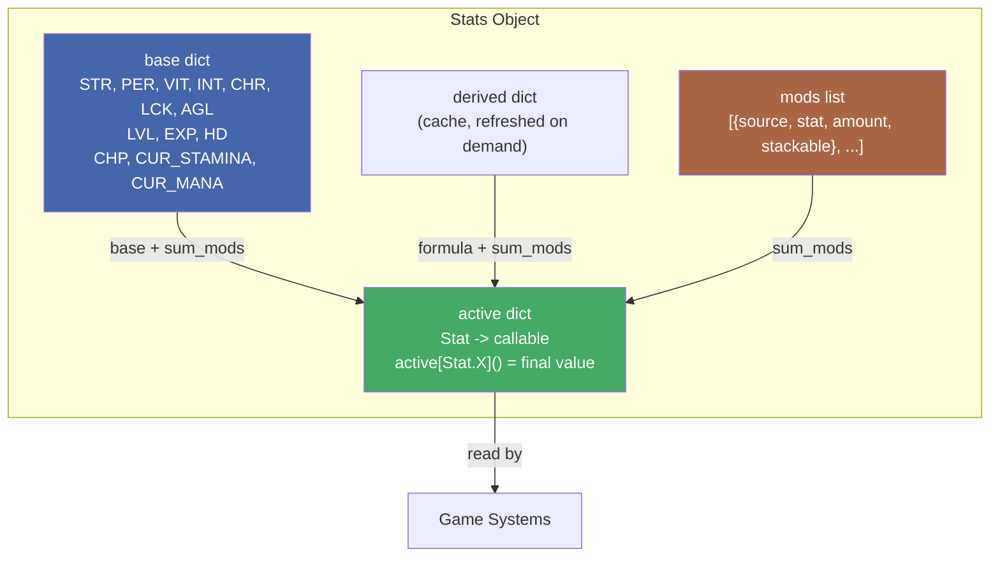
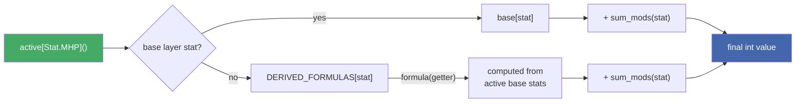
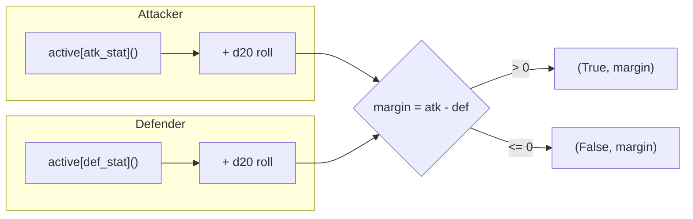
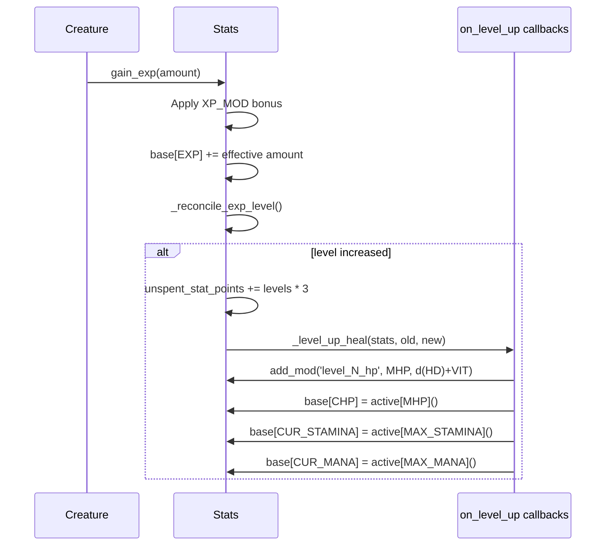

# Stats System ERD

## Four-Layer Architecture

## Active Value Resolution

## Derived Stat Formula Map

```mermaid
graph TD
    subgraph "Base Stats"
        STR[STR]
        PER[PER]
        VIT[VIT]
        INT_[INT]
        CHR[CHR]
        LCK[LCK]
        AGL[AGL]
    end

    subgraph "Combat"
        STR --> MELEE[MELEE_DMG]
        STR --> BLOCK[BLOCK]
        STR --> CRIT_DMG[CRIT_DMG]
        PER --> RANGED[RANGED_DMG]
        PER --> ACCURACY[ACCURACY]
        PER --> CRIT_DMG
        INT_ --> MAGIC[MAGIC_DMG]
        AGL --> ATK_SPD[ATK_SPEED]
        AGL --> DODGE[DODGE]
        LCK --> CRIT_CH[CRIT_CHANCE]
        VIT --> MHP[MHP]
        VIT --> ARMOR[ARMOR]
    end

    subgraph "Movement"
        AGL --> MOVE[MOVE_SPEED]
        AGL --> STEALTH[STEALTH]
        PER --> SIGHT[SIGHT_RANGE]
        PER --> HEARING[HEARING_RANGE]
        PER --> DETECT[DETECTION]
        STR --> CARRY[CARRY_WEIGHT]
    end

    subgraph "Resources"
        VIT --> MSTAM[MAX_STAMINA]
        AGL --> MSTAM
        INT_ --> MMANA[MAX_MANA]
        INT_ --> MREGEN[MANA_REGEN]
        VIT --> HPREGEN[HP_REGEN]
        AGL --> STAMREG[STAM_REGEN]
    end

    subgraph "Resistance"
        VIT --> POISON[POISON_RESIST]
        VIT --> DISEASE[DISEASE_RESIST]
        INT_ --> MAGRES[MAGIC_RESIST]
        STR --> STAGGER[STAGGER_RESIST]
        CHR --> FEAR[FEAR_RESIST]
    end

    subgraph "Social"
        CHR --> BARTER[BARTER_MOD]
        CHR --> DISP[NPC_DISPOSITION]
        CHR --> COMP[COMPANION_LIMIT]
        CHR --> PERS[PERSUASION]
        INT_ --> PERS
        CHR --> INTIM[INTIMIDATION]
        STR --> INTIM
        CHR --> DECEP[DECEPTION]
        AGL --> DECEP
    end

    subgraph "Loot/Craft"
        LCK --> LOOT[LOOT_QUALITY]
        INT_ --> CRAFT[CRAFT_QUALITY]
        PER --> CRAFT
        STR --> DURAB[DURABILITY_USE]
        INT_ --> XP[XP_MOD]
        LCK --> XP
    end
```

## Opposing Stat Contests

| Contest Name | Attacker Stat | Defender Stat |
|---|---|---|
| stealth_vs_detection | STEALTH | DETECTION |
| accuracy_vs_dodge | ACCURACY | DODGE |
| persuasion_vs_fear | PERSUASION | FEAR_RESIST |
| intimidation_vs_fear | INTIMIDATION | FEAR_RESIST |
| deception_vs_detection | DECEPTION | DETECTION |
| melee_vs_armor | MELEE_DMG | ARMOR |
| melee_vs_block | MELEE_DMG | BLOCK |
| magic_vs_resist | MAGIC_DMG | MAGIC_RESIST |
| stagger_vs_resist | MELEE_DMG | STAGGER_RESIST |
| poison_vs_resist | MAGIC_DMG | POISON_RESIST |

## Leveling Flow

