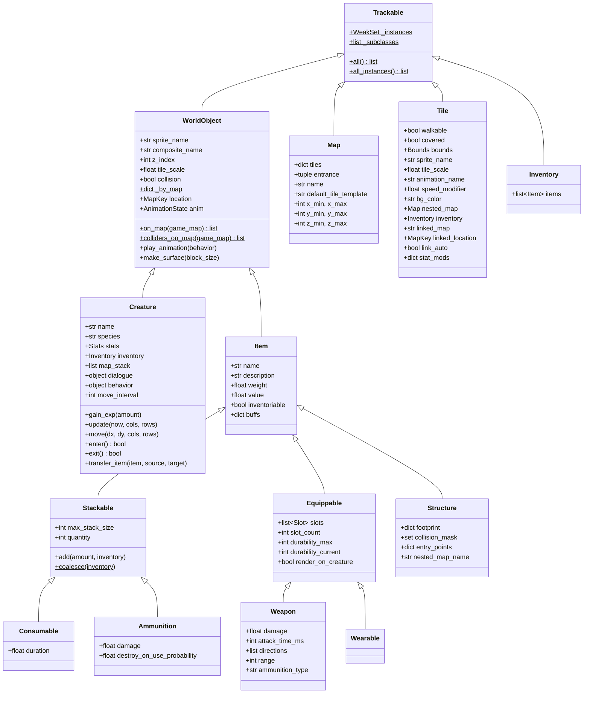
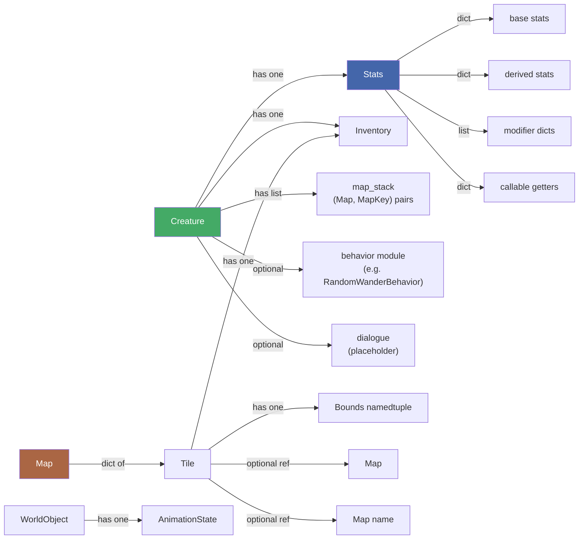
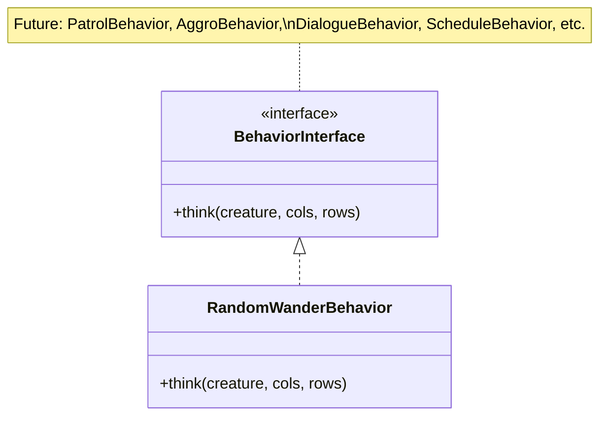

# Class Hierarchy ERD

## Inheritance Tree

```mermaid
classDiagram
    Trackable <|-- WorldObject
    Trackable <|-- Map
    Trackable <|-- Tile
    Trackable <|-- Inventory

    WorldObject <|-- Creature
    WorldObject <|-- Item

    Item <|-- Stackable
    Item <|-- Equippable
    Item <|-- Structure

    Stackable <|-- Consumable
    Stackable <|-- Ammunition

    Equippable <|-- Weapon
    Equippable <|-- Wearable

    class Trackable {
        +WeakSet _instances$
        +list _subclasses$
        +all()$ list
        +all_instances()$ list
    }

    class WorldObject {
        +str sprite_name
        +str composite_name
        +int z_index
        +float tile_scale
        +bool collision
        +dict _by_map$
        +on_map(game_map)$ list
        +colliders_on_map(game_map)$ list
        +MapKey location
        +AnimationState anim
        +play_animation(behavior)
        +make_surface(block_size)
    }

    class Creature {
        +str name
        +str species
        +Stats stats
        +Inventory inventory
        +list map_stack
        +object dialogue
        +object behavior
        +int move_interval
        +gain_exp(amount)
        +update(now, cols, rows)
        +move(dx, dy, cols, rows)
        +enter() bool
        +exit() bool
        +transfer_item(item, source, target)
    }

    class Item {
        +str name
        +str description
        +float weight
        +float value
        +bool inventoriable
        +dict buffs
    }

    class Stackable {
        +int max_stack_size
        +int quantity
        +add(amount, inventory)
        +coalesce(inventory)$
    }

    class Consumable {
        +float duration
    }

    class Ammunition {
        +float damage
        +float destroy_on_use_probability
    }

    class Equippable {
        +list~Slot~ slots
        +int slot_count
        +int durability_max
        +int durability_current
        +bool render_on_creature
    }

    class Weapon {
        +float damage
        +int attack_time_ms
        +list directions
        +int range
        +str ammunition_type
    }

    class Wearable {
    }

    class Structure {
        +dict footprint
        +set collision_mask
        +dict entry_points
        +str nested_map_name
    }

    class Map {
        +dict tiles
        +tuple entrance
        +str name
        +str default_tile_template
        +int x_min, x_max
        +int y_min, y_max
        +int z_min, z_max
    }

    class Tile {
        +bool walkable
        +bool covered
        +Bounds bounds
        +str sprite_name
        +float tile_scale
        +str animation_name
        +float speed_modifier
        +str bg_color
        +Map nested_map
        +Inventory inventory
        +str linked_map
        +MapKey linked_location
        +bool link_auto
        +dict stat_mods
    }

    class Inventory {
        +list~Item~ items
    }
```

## Composition Relationships

```mermaid
graph LR
    Creature -->|has one| Stats
    Creature -->|has one| Inventory
    Creature -->|has list| map_stack["map_stack<br/>(Map, MapKey) pairs"]
    Creature -->|optional| behavior["behavior module<br/>(e.g. RandomWanderBehavior)"]
    Creature -->|optional| dialogue["dialogue<br/>(placeholder)"]

    Map -->|dict of| Tile
    Tile -->|has one| Inventory
    Tile -->|has one| Bounds["Bounds namedtuple"]
    Tile -->|optional ref| nested_map[Map]
    Tile -->|optional ref| linked_map[Map name]

    WorldObject -->|has one| AnimationState

    Stats -->|dict| base["base stats"]
    Stats -->|dict| derived["derived stats"]
    Stats -->|list| mods["modifier dicts"]
    Stats -->|dict| active["callable getters"]

    style Stats fill:#46a,color:#fff
    style Creature fill:#4a6,color:#fff
    style Map fill:#a64,color:#fff
```

## Behavior Module Interface

All creatures use the same class. Behavioral differences come from behavior modules:

```mermaid
classDiagram
    class BehaviorInterface {
        <<interface>>
        +think(creature, cols, rows)
    }

    class RandomWanderBehavior {
        +think(creature, cols, rows)
    }

    BehaviorInterface <|.. RandomWanderBehavior

    note for BehaviorInterface "Future: PatrolBehavior, AggroBehavior,\nDialogueBehavior, ScheduleBehavior, etc."
```
